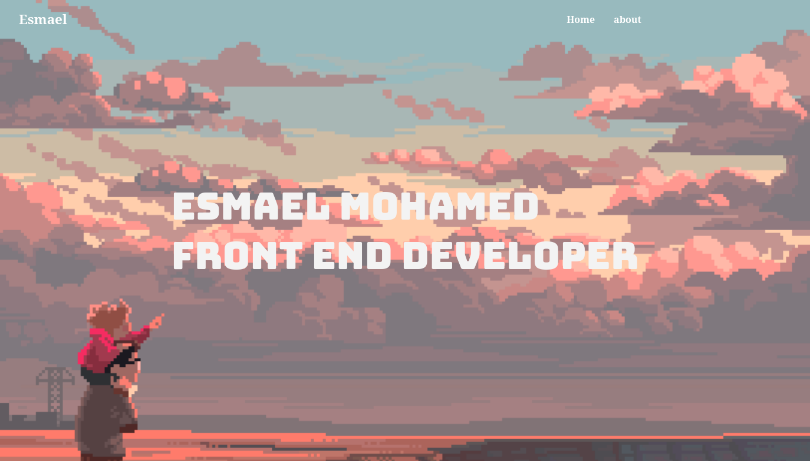
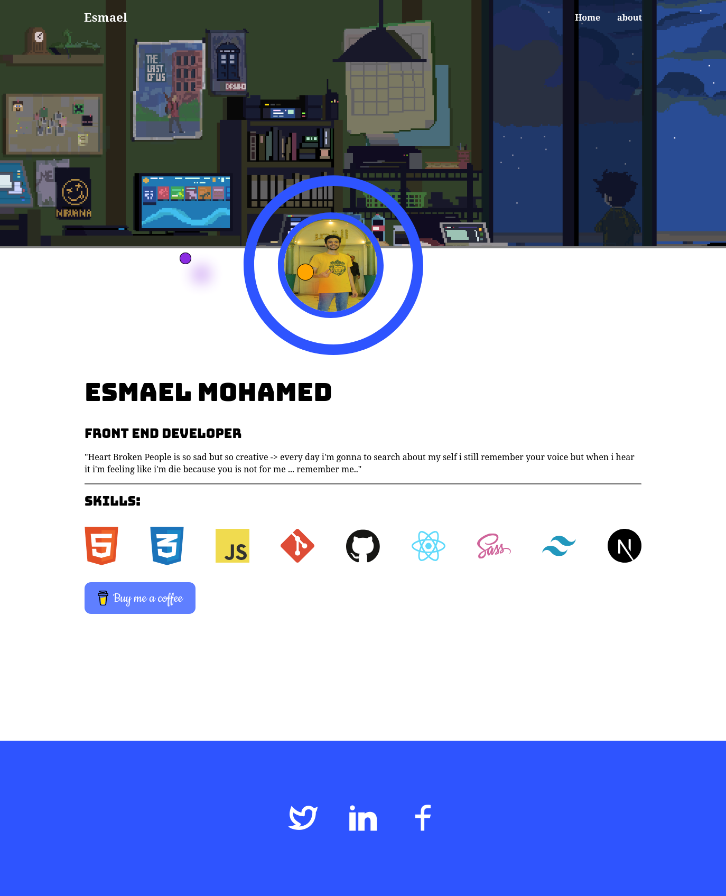

# Personal Blog Post

## Overview

This project showcases a personal blog post created using modern HTML5 and CSS techniques, including flexbox and grid layouts. The blog is designed to be responsive, ensuring a seamless experience across various devices and screen sizes.

## Preview

## Technologies Used

- **HTML5**: Structure and semantic markup.
- **CSS3**: Styling with modern techniques.
  - **Flexbox**: For creating flexible layouts.
  - **Grid**: For advanced grid-based layouts.
  - **Media Queries**: To ensure responsiveness across different devices.

## Features

- Responsive design that adapts to various screen sizes.
- Modern layout techniques for a clean and structured appearance.
- Well-structured HTML for better SEO and accessibility.

## Resources

- [Pinterest](https://www.pinterest.com): A platform for finding and sharing creative ideas, useful for design inspiration.
- [Remix Icon](https://remixicon.com): A set of open-source icons that can be easily integrated into your project for better visual communication.

